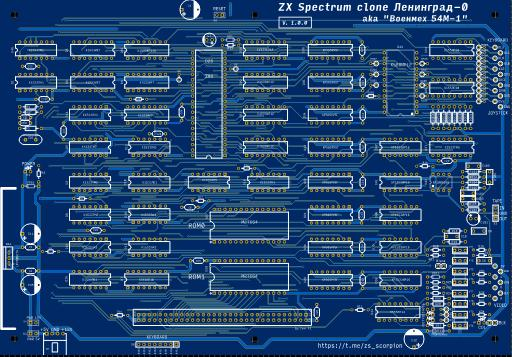

# Ленинград-0

## Российский клон компьютера ZX Spectrum

Вероятно, является самым старым клоном ZX Spectrum на территории СССР. Автор схемы неизвестен. Разработана, ориентировочно, в 1987 году.
Некоторые, называют данный клон "Военмех-54М-1", вероятно, в то время, кто-то мог собирать его на территории ленинградского ВУЗА "Военмех".

Данная реплика восстановлена по известным схемам, которые были найдены на форуме zx-pk.ru. К сожалению, в более-менее нормальном качестве
удалось найти только фотографии с верхней стороны печатной платы. Нижнюю сторону пришлось трассировать заново.
Вероятно, что данная схема побудила Сергея Зонова разработать широко известный клон "Ленинград-1".

Есть несколько вариантов данной схемы. Эта более поздняя, с дополнительной микросхемой ТМ2, для возможности использования кварцевого резонатора на 14МГц.
Схема так же содержит параметрический стабилизатор на микросхеме КР142ЕН5 (LM7805). Диоды VD5-VD12 в оригинале расппаиваются на плате клавиатуры. Я их разместил
на обратной стороне основной платы в корпусах SMD, так же добавил разъем X8 для подключения клавиатуры. При желании, можно не запаивать не то и не другое и подключаться 
напрямую к контактам системного разъема. Системный разъем так же заменен с оригинального  ГРПМ1-61 на современный  64-пиновый.

## Особенности:
- Z80 CPU на чатоте 3,5МГц
- Одно поле памяти 48k на микросхемах DRAM КР565РУ5.

[Принципиальная схема](Export/Schematics-Lenongrad-0_v1.0.0.pdf)

[Монтажная схема](Export/PCB_Leningrad-0_v1.0.0.pdf)

[Чат Scorpion ZS & Ленинград в Telegram](https://t.me/zs_scorpion)

## Внимание!
- Печатная плата и схема проходят DRC, по данной схеме и герберам плата не изготавливалась.

